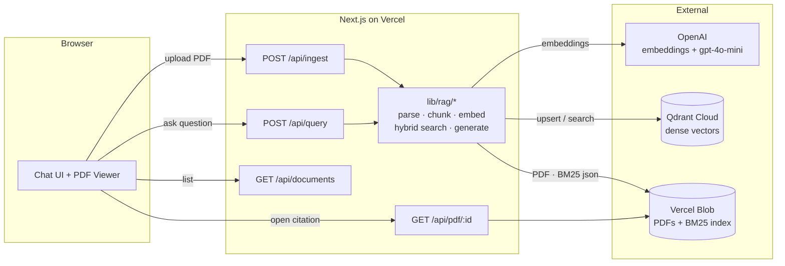

# PDF RAG

A PDF retrieval-augmented generation app. Upload a PDF, ask a question, get an answer grounded in the document with inline citations that jump straight to the page and highlight the cited text.

Built as a response to the Poppulo coding challenge. **No RAG abstraction frameworks** (no LangChain / LlamaIndex) — the retrieval logic is all in [`lib/rag/`](./lib/rag/) and easy to audit.

## Live demo
[](https://drive.google.com/file/d/18LY_RdkSdZZR23MJwO0HiBgCdIQ9RESX/view?usp=sharing)


## Highlights

- **Hybrid retrieval.** Dense embeddings (OpenAI `text-embedding-3-small`) + BM25 over the chunk text, fused with [Reciprocal Rank Fusion](./lib/rag/rrf.ts). Dense catches semantic matches; BM25 catches rare technical terms (e.g. "DeepSeek-R1-Zero") that embeddings can under-weight.
- **Query expansion.** A cheap `gpt-4o-mini` call rewrites the question into 3 paraphrases before retrieval, defeating vocabulary mismatch.
- **LLM re-rank.** The fused top-N is scored 0–3 by `gpt-4o-mini` and the best are sent to the answerer.
- **Validated citations.** The model is required to quote a short span from each source; quotes that aren't a loose substring of their chunk are dropped as hallucinations before the answer ships to the client.
- **Click-through citation viewer.** Every citation chip opens a side `react-pdf` viewer jumped to the correct page with the quoted span highlighted in yellow.
- **Small-to-big ready.** Chunks carry `page` + `paragraphIdx` so we can map retrieval hits back to their source for highlight / display.
- **Deployable as one unit.** Next.js API routes + React UI → single Vercel deploy, no second service.

## Architecture



### Request lifecycle

**Ingest** (`POST /api/ingest`, multipart file or `{ url }`):

```
PDF bytes
  └─ pdfjs-dist            // extract text items with (x, y, height)
      └─ group items to lines (y-proximity)
          └─ group lines to paragraphs (y-gap > 1.55 × median line height)
              └─ strip repeated headers/footers + page numbers
                  └─ sentence-aware chunker (~450 tokens, ~80 overlap)
                      └─ OpenAI embeddings (batched, retried)
                          ├─ Qdrant upsert (vectors + payload)
                          └─ BM25 index update (persisted JSON)
                              └─ PDF stored in Vercel Blob
                                  └─ document registry updated
```

**Query** (`POST /api/query`, `{ question }`):

```
question
  └─ query expansion (gpt-4o-mini → 3 paraphrases)
      └─ for each paraphrase:
              dense search (Qdrant, top 20)
              sparse search (BM25, top 20)
          └─ Reciprocal Rank Fusion (k=60)
              └─ top-N candidates → LLM rerank (gpt-4o-mini, score 0–3)
                  └─ top-K passages → answer model (gpt-4o-mini, streamed)
                      └─ SSE: retrieved chunks → token deltas → done { citations }
```

## Local development

### 1. Prerequisites

- Node 20+
- A free-tier **Qdrant Cloud** cluster — https://cloud.qdrant.io
- An **OpenAI API key** — https://platform.openai.com/api-keys

### 2. Install & configure

```bash
pnpm install
cp .env.example .env.local
# then fill in OPENAI_API_KEY, QDRANT_URL, QDRANT_API_KEY
```

### 3. Run

```bash
pnpm dev          # http://localhost:3000
pnpm test         # unit tests (chunker, BM25, RRF, citation validator)
pnpm seed         # download + ingest the two sample arXiv PDFs
pnpm typecheck    # tsc --noEmit
```

In local dev, PDFs and the BM25 index are written to `./.data/` on disk. On Vercel they go to Vercel Blob.

## Deploying

Deploy to Vercel:

```bash
vercel          # first time — link a project
vercel --prod   # production deploy
```

In the Vercel dashboard:
1. Set `OPENAI_API_KEY`, `QDRANT_URL`, `QDRANT_API_KEY` as env vars.
2. Enable a **Blob** store — `BLOB_READ_WRITE_TOKEN` is injected automatically.

## Configuration

All env vars live in [`.env.example`](./.env.example). Model defaults:

| Purpose | Env var | Default |
|---|---|---|
| Embeddings | `OPENAI_EMBED_MODEL` | `text-embedding-3-small` |
| Query expansion & re-rank | `OPENAI_RERANK_MODEL` | `gpt-4o-mini` |
| Answer generation | `OPENAI_ANSWER_MODEL` | `gpt-4o-mini` |
| Qdrant collection | `QDRANT_COLLECTION` | `rag_chunks` |

The UI has a model toggle that passes `gpt-4o` at query time when the user selects it.

## Project layout

```
rag-challenge/
├── app/
│   ├── page.tsx                    # root (renders Workbench)
│   ├── components/
│   │   ├── Workbench.tsx           # 3-pane layout: docs · chat · pdf
│   │   ├── Chat.tsx                # chat input, citation chips
│   │   ├── DocumentsPanel.tsx      # upload / URL-ingest / list / delete
│   │   └── PdfPreview.tsx          # react-pdf viewer with span highlight
│   └── api/
│       ├── ingest/route.ts         # POST PDF → chunks → Qdrant
│       ├── query/route.ts          # POST question → answer + citations
│       ├── documents/route.ts      # GET list / DELETE by id
│       └── pdf/[id]/route.ts       # GET raw PDF bytes for the viewer
├── lib/rag/
│   ├── pdf.ts                      # pdfjs-dist → paragraphs
│   ├── chunk.ts                    # sentence-aware chunker
│   ├── embed.ts                    # OpenAI embeddings + retry
│   ├── bm25.ts                     # BM25 index, serializable to JSON
│   ├── qdrant.ts                   # thin Qdrant client wrapper
│   ├── rrf.ts                      # Reciprocal Rank Fusion
│   ├── retrieve.ts                 # query expansion + hybrid + rerank
│   ├── generate.ts                 # cited-answer prompt + validator
│   ├── ingest.ts                   # ingestion orchestration
│   ├── documents.ts                # document registry (Blob / disk)
│   └── storage.ts                  # key-value abstraction (Blob / disk)
├── scripts/seed.ts                 # ingest the 2 sample PDFs
└── tests/                          # vitest unit tests
```

## Design notes

### Why these choices

- **Next.js + TS on Vercel.** One repo, one deploy, no CORS, one set of env vars. The challenge explicitly forbids RAG-abstraction frameworks but allows official clients; this stack keeps the RAG core readable and Node-native while getting a live URL in a single command.
- **Qdrant Cloud.** Managed free-tier, great TS client, sub-100ms queries, supports payload filtering (`docId`) for per-document scoping. pgvector was the fallback but adds a second service to manage.
- **BM25 persisted as JSON.** Keeps the sparse index auditable and trivially portable. On a cold serverless invocation the index is re-fetched once from Blob and cached in module scope.
- **Hand-rolled sentence-aware chunker.** The eval criterion explicitly calls out wanting to see RAG logic, so the chunker is ours: it respects paragraph boundaries, uses `Intl.Segmenter` for sentence splits, and estimates tokens without a tiktoken dependency (Vercel bundle-size win).
- **Hybrid + RRF + LLM rerank.** Each stage is optional via a flag and independently tested. Dense alone misses exact-match lookups ("DeepSeek-R1-Zero"); BM25 alone misses paraphrase-heavy questions; RRF combines them without needing calibrated scores; LLM rerank tightens precision on the final top-K.
- **Substring citation validation.** The answer model is tempted to paraphrase its quotes; [`looseContains`](./lib/rag/generate.ts) accepts whitespace/punctuation drift but rejects fabrications.

### Edge cases handled

- **Scanned / image-only PDFs.** If parsing yields no text the ingest route returns a clear 500 with a message — OCR is explicitly out of scope.
- **Oversized PDFs.** 25 MB hard cap returned as 413. arXiv PDFs are comfortably under.
- **Empty corpus.** Chat input is disabled with a "upload a PDF first" placeholder.
- **LLM malformed JSON.** Wrapped in try/catch; falls back to a user-visible error instead of crashing.
- **Hallucinated citations.** Substring-validated; any quote not present in its cited chunk is dropped before the response returns.
- **OpenAI 429 / 5xx.** Embeddings retry with exponential backoff (4 attempts).
- **Cross-paragraph bleed.** Chunker never spans paragraph boundaries, so citations always resolve to a single `(page, paragraph)`.

### Known limitations / stretch ideas

- No OCR for scanned PDFs.
- No per-user auth or rate limiting — it's a demo.
- HyDE (hypothetical document embeddings) would likely improve recall further on abstract questions.

## License

MIT.
